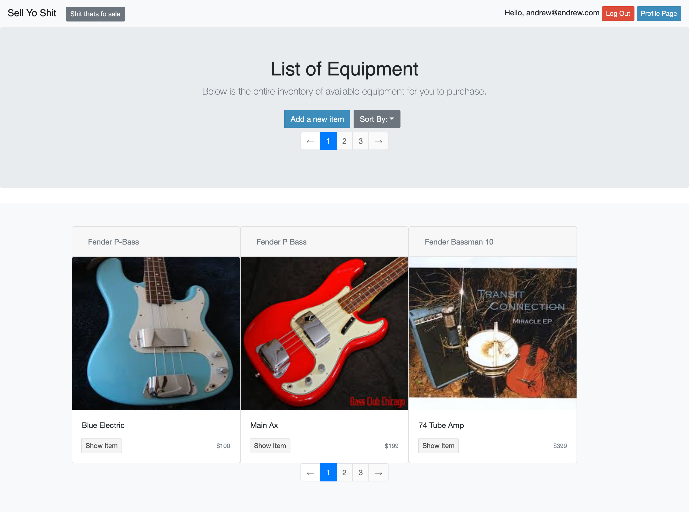

# Music_Sales App

*This app is designed to allow users to upload their own musical equipment for sale.*

* Ruby version: 2.4.2

* Rails version: 5.2.3

* Database creation:
>run rake db:seed.rb for test user and item examples

* Testing: Using Rspec + Capybara in /spec folder
